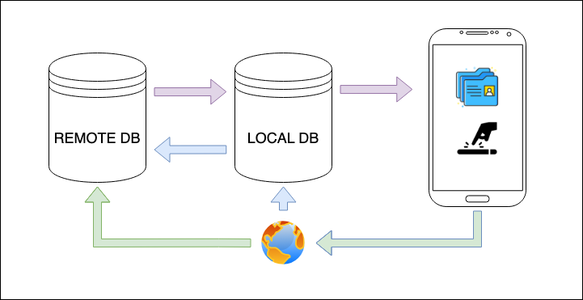
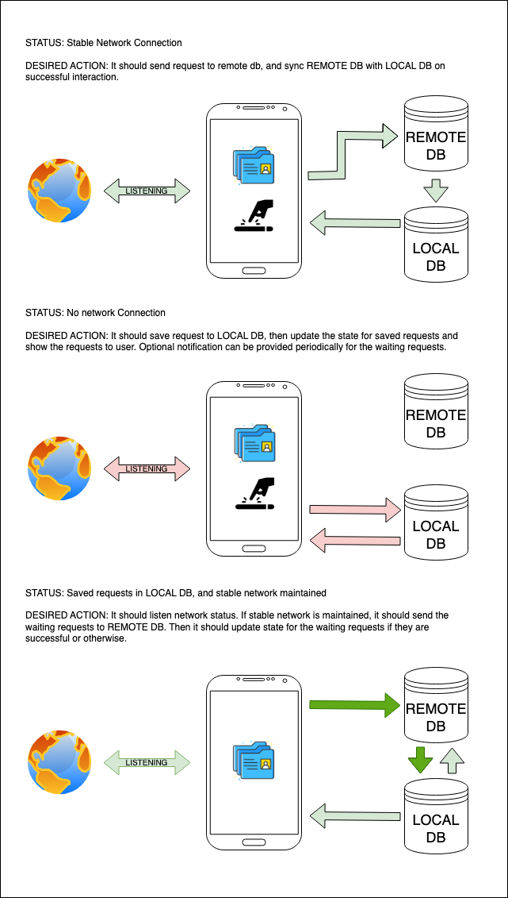
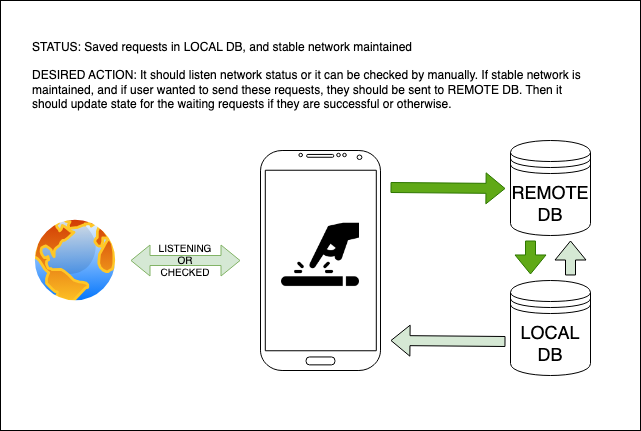
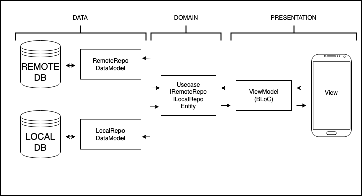

# SyncNet&LocalDB

- [SyncNet\&LocalDB](#syncnetlocaldb)
  - [1. App Description](#1-app-description)
  - [2. Environment](#2-environment)
  - [3. How to run project](#3-how-to-run-project)
    - [a. Install Flutter and Dart](#a-install-flutter-and-dart)
    - [b. Set Up an Integrated Development Environment (IDE)](#b-set-up-an-integrated-development-environment-ide)
    - [c. Connect a Device or Emulator](#c-connect-a-device-or-emulator)
    - [d. Run the Flutter App](#d-run-the-flutter-app)
  - [4. Project Structure](#4-project-structure)
  - [5. Folder Structure](#5-folder-structure)
  - [6. Bloc + Freezed usage](#6-bloc--freezed-usage)
  - [7. Local DB Service](#7-local-db-service)
      - [Constructor](#constructor)
      - [Methods](#methods)
      - [getData](#getdata)
      - [initWatcher](#initwatcher)
      - [saveData](#savedata)
      - [removeCollection](#removecollection)
      - [removeData](#removedata)
  - [7. Offline Request Service](#7-offline-request-service)
    - [a. OfflineSendRequestUsecase](#a-offlinesendrequestusecase)
    - [b. OfflineGetRequestUsecase](#b-offlinegetrequestusecase)
    - [c. OfflineSaveRequestUsecase](#c-offlinesaverequestusecase)
    - [d. OfflineDeleteRequestUsecase](#d-offlinedeleterequestusecase)
    - [e. OfflineUpdateRequestUsecase](#e-offlineupdaterequestusecase)
    - [f. OfflineWatchDBUsecase](#f-offlinewatchdbusecase)


## 1. App Description



This demo app is designed to provide fully-functioned offline capabilities for users. There is a remote DB in **Firebase Realtime DB** that holds data of the users.

App will act as an offline-first app. It will always gives the user local db data. And when network is available it will get data from remote DB, and sync data for the local DB of the device.

There are CRUD operations for users. When network is available, it will send the requests. When network is not available, it will save the request data. There are two options for sending saved requests: **Auto-Sync** and **by Hand**.

If **Auto-Sync** is chosen, it will listen network status and if network is okay it will send the saved requests data automatically.



If **by Hand** is chosen, it will send the requests by decision of the user. First two status stated above in the diagram is same for 'by Hand' also.



When there are saved requests and if they are not sent, the app will send reminding notifications periodically.

## 2. Environment

- Flutter (Channel stable, 3.19.2, on macOS 14.4.1 23E224 darwin-arm64, locale en-TR)
- Android toolchain - develop for Android devices (Android SDK version 34.0.0)
- Xcode - develop for iOS and macOS (Xcode 15.3)
- Chrome - develop for the web
- Android Studio (version 2023.1)
- VS Code (version 1.87.2)

## 3. How to run project

### a. Install Flutter and Dart

First, make sure you have Flutter and Dart installed on your computer. You can download and install them from the official Flutter website: [Flutter Installation Guide](https://docs.flutter.dev/get-started/install).

### b. Set Up an Integrated Development Environment (IDE)

Choose an IDE for Flutter development. Two popular options are:
**Android Studio**: It comes with built-in Flutter support and is the official IDE recommended by Google for Flutter development.
**Visual Studio Code (VS Code)**: You can install the Flutter and Dart plugins to get Flutter development support in VS Code.

### c. Connect a Device or Emulator

You'll need a physical device (e.g., a smartphone or tablet) connected to your computer or an emulator (Android Virtual Device or iOS Simulator) set up to run your Flutter app. Ensure that your device is in developer mode and connected via USB if using a physical device.

Real device is recommended because of the testing network status easily.

### d. Run the Flutter App

We cannot share the base url for the firebase project. But you can start it on your own by looking url structures and remote models in [HomeRemoteRepo](lib/feature/home/data/repo/home_remote_repo.dart) and all over the project by looking 'RemoteRepo' key.

```sh
flutter run --dart-define BASE-URL=your_base_url
```

## 4. Project Structure

It has been used Clean Architecture and Domain-Driven Design (DDD) principles in the project.

This structure promotes separation of concerns and allows you to develop the app in a modular and testable way. You can expand upon this structure based on your project's specific requirements and complexity. Additionally, make sure to adhere to the SOLID principles and DDD concepts as you design and implement your Flutter app to ensure maintainability and scalability. For further information please check:


- [The Clean Architecture by Uncle Bob](https://blog.cleancoder.com/uncle-bob/2012/08/13/the-clean-architecture.html)
- [A Guided Tour of Clean Architecture](https://www.freecodecamp.org/news/a-quick-introduction-to-clean-architecture-990c014448d2/)
- [Domain-Driven Design Quickly PDF](https://www.infoq.com/minibooks/domain-driven-design-quickly/)
- [Reso Coder Clean Architecture Tutorials](https://resocoder.com/flutter-clean-architecture-tdd/)

## 5. Folder Structure



Here's a basic project structure outline that combines Clean Architecture and Domain-Driven Design (DDD) principles approaches:

    sync-net-and-local-db/
      └── lib/
           ├── core/
           │     ├── constant/
           │     ├── dependency_injection/
           │     ├── exception/
           │     ├── enums/
           │     ├── helper/
           │     └── services/
           └── feature/
                 ├── common/
                 └── one_of_feature/
                       ├── core/
                       ├── data/
                       │    ├── model/
                       │    │     ├── local/
                       │    │     │     └── x_local_model.dart/
                       │    │     └── remote/
                       │    │           └── x_remote_model.dart/
                       │    └── repo/
                       │          ├── one_of_feature_local_repo.dart/
                       │          └── one_of_feature_repo_repo.dart/
                       ├── domain/
                       │    ├── repo/
                       │    │     ├── i_one_of_feature_local_repo.dart/
                       │    │     └── i_one_of_feature_remote_repo.dart/
                       │    ├── usecase/
                       │    └── entity/
                       │          └── x_entity.dart/
                       └── presentation/
                            ├── provider/
                            ├── view/
                            └── widget/


- **lib**: This is the main application code directory.
  - **core**: It contains common structures and datas used throughout the application.
  - **feature**: It contains modules of the project.
    - **core**: It contains feature related files and files that must not get into other folders.
    - **data**: It contains data sources, repositories implementations, and data models for data persistence.
    - **domain**: It contains domain entities, repositories, usecases and value objects as per DDD principles.
    - **presentation**: It contains user interface components, including pages, widgets and state classes.

## 6. Bloc + Freezed usage

[Bloc](https://pub.dev/packages/flutter_bloc) and [Freezed](https://pub.dev/packages/freezed) can be used together to manage state in a Flutter application.

Bloc is a state management library that uses the concept of events to trigger state changes. It separates the business logic from the UI, making the code more maintainable and testable.

Freezed is a code generation library that helps in creating immutable classes and unions (sealed classes) in Dart. It simplifies the process of creating immutable objects and provides a clean, simple way to define immutable data models.

When used together, Bloc and Freezed offer several benefits:

Immutable State: Freezed provides a way to create immutable state classes, which can help prevent unwanted state changes.

Reduced Boilerplate: Freezed generates the boilerplate code required for immutable classes, reducing the amount of code you need to write.

Clear State Transitions: By using Freezed with Bloc, you can define clear, type-safe state transitions. This makes it easier to understand how different events affect the state of your application.

Enhanced Testability: The combination of Bloc and Freezed makes your code more testable. You can easily test the different states of your application and how different events lead to different states.

Here's an example of how you can use Bloc and Freezed together:
```dart
@freezed
abstract class MyState with _$MyState {
    const factory MyState.initial() = _Initial;
    const factory MyState.loading() = _Loading;
    const factory MyState.loaded(List<Data> data) = _Loaded;
}

class MyCubit extends Cubit<MyState> {
    MyCubit() : super(MyState.initial());

    void loadData() async {
        emit(MyState.loading());
        final data = await fetchData();
        emit(MyState.loaded(data));
    }
}
```

In this example, the MyState class is defined using Freezed, and the MyCubit class uses this state class to manage its state. The loadData method in MyCubit emits different states based on the progress of the data loading operation.

## 7. Local DB Service

[LocalDBService](lib/core/services/local_db_service/local_db_service.dart) is a class that implements the ILocalDBService interface. It provides methods for interacting with a local database using the [Isar package](https://pub.dev/packages/isar).

#### Constructor
```dart
const LocalDBService(this._isar);
```

The constructor takes an instance of Isar as a parameter. This instance is used for all database operations.

#### Methods
#### getData
```dart
Future<List<E>> getData<E>();
```

This method retrieves all data of type E from the local database. It returns a Future that completes with a List<E>.

#### initWatcher
```dart
void initWatcher<E>(void Function(List<E>) callback);
```
This method initializes a watcher on the collection of type E in the local database. Whenever data in the collection changes, the provided callback function is called with the updated data.

#### saveData
```dart
Future<void> saveData<E>(List<E> list);
```
This method saves a list of data of type E to the local database. It returns a Future that completes when the operation is finished.

#### removeCollection
```dart
Future<void> removeCollection<E>();
```
This method removes all data of type E from the local database. It returns a Future that completes when the operation is finished.

#### removeData
```dart
Future<void> removeData<E>(int id);
```
This method takes the id of the item and remove it from local DB.

## 7. Offline Request Service

This service is written as kind of a middleware. You can use entites and usecases for your needs.

Main purpose of this service is you can integrate it in your **Remote Repos** and save the requests that are not sent because of the connection errors. Taking the items as [OfflineRequestEntity](lib/core/services/offline_request_service/domain/entity/offline_request_entity.dart) and save it to local DB. Gives it to you in same class type. You can use it in your UI. It also gives you a watcher for the items that you are saving.

It depends on a **Local DB Service** for CRUD operations and a **Network Service** for sending saved requests.

Predicted possible error scenarios are:

- Changed URL paths,
- Changed request bodys,
- Changed request methods,
  
Service does not return a body because it is not needed for now. 

There are three status for saved request:

* **Waiting:**
  These items are the waiting ones to send when network is available.
* **Success:**
  These items are the sent ones that are sent successfully.
* **NotSent:**
  These items are the errored ones that are not sent because of any reasons.

The last but not the least, control mechanism should be in the backend side. For example; we are updating remote DB according to time. If we try to make this control in client side, I should get data first and compare desired property and send the data or vice versa. I put the control mechanism any way in [OfflineCubit](lib/feature/offline_requests/presentation/cubit/offline_cubit.dart) for the demo. But if you insist on putting control in client side, control mechanism should be in [OfflineSendRequestUsecase](lib/core/services/offline_request_service/domain/usecase/offline_send_request_usecase.dart) for my humble opinion.

Now here are the usecases that you should use:

### a. OfflineSendRequestUsecase
This usecase is for sending saved requests. It gets the **OfflineRequestEntity** and sending the requests.

I did not make it as a one simple request for example it should get the saved request and send them in one action. The reasons for why I did not do like that are:

- Any error can happen while sending the requests and it should be handled on state side. So user can be notified for the fail requests.
- Because of the demo, control mechanism is in responsibility of the client side. But when it is in the backend side it would be safer to make this logic in the usecase. This demo is done for R&D purposes. It can shapen according to your needs. 

### b. OfflineGetRequestUsecase
This usecase is for getting saved requests. It gets nothing and returns array of **OfflineRequestEntity**.

### c. OfflineSaveRequestUsecase
This usecase is for saving requests to Local DB. It gets **OfflineRequestEntity** and saving it to Local DB.

It has a control mechanism for duplication. If item is already in the local DB it removes the old one and insert the new one.

### d. OfflineDeleteRequestUsecase
This usecase is for deleting requests. It gets id and removes the item.

### e. OfflineUpdateRequestUsecase
This usecase is for updating requests. It gets **OfflineRequestEntity** and updates the item.

### f. OfflineWatchDBUsecase
This usecase is for listening local DB for saved requests. It gets a callback function and in that function it returns the saved requests in DB. It is useful for updating UI.